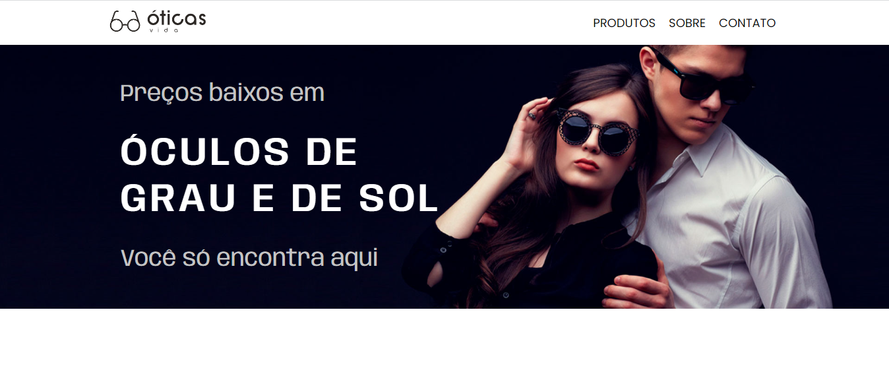

<h1 align="center"> Óticas vida </h1>

Esse projeto foi proposto pela plataforma da devmedia. 

  

 

  

## 🚀 Tecnologias

Esse projeto foi desenvolvido com as seguintes tecnologias:

- CSS
- React.js
- Git e Github
- Figma

## 💻 Projeto

A óticas vida é uma página de ótica que anuncia os produtos vendidos pela mesma.

- [Visite o projeto online](https://miguelsabino23.github.io/otica/)

## :memo: Licença

Esse projeto está sob a licença MIT.

---
